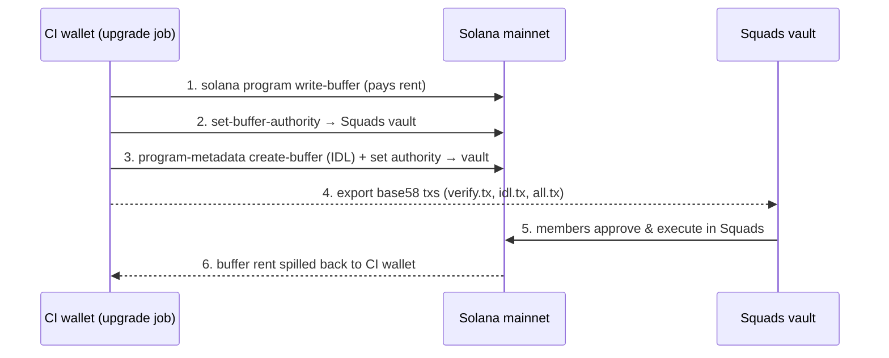

# Deployment

This guide explains how the Nosana programs are deployed and upgraded, and what
each job in the GitLab CI pipeline (`.gitlab-ci.yml`) does. The short version:
**devnet upgrades are fully automated from CI; mainnet upgrades are prepared by
CI but signed and executed through our [Squads](https://squads.so) multisig.**

## Pipeline overview

All jobs run in the
[`containers/anchor`](https://gitlab.com/nosana-ci/tools/containers/anchor)
image, which bundles the Rust/Solana/Anchor toolchain plus the `solana-verify`
and `program-metadata` CLIs.

| Stage    | Job              | Runs on                | What it does                                                            |
| -------- | ---------------- | ---------------------- | ----------------------------------------------------------------------- |
| `.pre`   | `rust-fmt`       | MRs and `main`         | `cargo fmt --check` on all crates                                        |
| `.pre`   | `npm`            | MRs and `main`         | `npm ci`, then `eslint` / `prettier` on `scripts/` and `tests/`          |
| `build`  | `build`          | MRs, `main`, and tags  | `anchor build -- --features $CLUSTER`; artifacts: `target/deploy/*.so` and `target/idl/*.json` |
| `test`   | `test`           | MRs and `main`         | `anchor test` against a local validator, plus `cargo check --release`    |
| `test`   | `scenario`       | MRs and `main`         | `anchor test` once per test scenario (jobs, pools, rewards, staking, …)  |
| `deploy` | `upgrade`        | **manual**; `main` (devnet) or version tags (mainnet) | runs `scripts/upgrade.sh`, see below       |
| `.post`  | `release`        | `main`                 | semver auto-bump (from the shared `semver.yml` template), creates the version tag |
| `.post`  | `gitlab-release` | tags                   | creates the GitLab release for the tag                                   |

The cluster is selected by *how the pipeline was triggered*:

- a pipeline on the `main` branch builds and upgrades **devnet**,
- a pipeline for a **version tag** (created by the `release` job) builds and
  upgrades **mainnet**.

The `upgrade` job is a manual matrix job — one entry per program:

| Program          | Program ID                                     | Note                 |
| ---------------- | ---------------------------------------------- | -------------------- |
| `nosana_staking` | `nosScmHY2uR24Zh751PmGj9ww9QRNHewh9H59AfrTJE`  |                      |
| `nosana_rewards` | `nosRB8DUV67oLNrL45bo2pFLrmsWPiewe2Lk2DRNYCp`  |                      |
| `nosana_pools`   | `nosPdZrfDzND1LAR28FLMDEATUPK53K8xbRBXAirevD`  |                      |
| `nosana_nodes`   | `nosNeZR64wiEhQc5j251bsP4WqDabT6hmz4PHyoHLGD`  |                      |
| `nosana_jobs`    | `nosJhNRqr2bc9g1nfGDcXXTXvYUmxD4cVwy2pMWhrYM`  | mainnet only (`SKIP_DEV`)  |
| `nosana_jobs`    | `nosJTmGQxvwXy23vng5UjkTbfv91Bzf9jEuro78dAGR`  | devnet only (`SKIP_MAIN`)  |

### CI variables

| Variable            | Where               | Purpose                                                                                                           |
| ------------------- | ------------------- |-------------------------------------------------------------------------------------------------------------------|
| `SOLANA_WALLET`     | CI/CD settings      | keypair for the CI wallet; written to `~/.config/solana/id.json` by the `.wallet` template and removed afterwards |
| `RPC_BASE` + `IRONFORGE_API_KEY` | `.gitlab-ci.yml` / CI settings | compose the [Ironforge](https://ironforge.network) RPC URL: `$RPC_BASE/$CLUSTER?apiKey=…`                         |
| `SQUADS_PUBKEY`     | `.gitlab-ci.yml`    | the Squads **vault** (`GXs53JMXbgdMDhtmjE9iNgSmC1gu8f3adZhXuCEq1Bx9`) — upgrade authority of all mainnet programs |
| `MSIG_ACCOUNT`      | `.gitlab-ci.yml`    | the Squads multisig account (`ktKWwDt5J8NFMi5jQNRRBDKAhimU5tnrGCcXuYJmxqE`)                                       |
| `BASE_IMAGE`        | CI settings         | docker base image for `anchor`, so builds are reproducible                                                        |

## The upgrade script

`scripts/upgrade.sh` first validates its environment (required variables, a
valid `CLUSTER`, and the `build` artifacts `target/deploy/$PROGRAM_NAME.so` and
`target/idl/$PROGRAM_NAME.json`), patches the IDL `address` field to the target
program ID, and then branches per cluster.

### Devnet

On devnet the CI wallet *is* the upgrade authority, so the script simply runs:

1. `anchor program upgrade` — deploys the new `.so`,
2. `anchor idl upgrade` — writes the patched IDL on-chain.

Nothing manual to do; the upgrade is live when the job finishes.

### Mainnet

On mainnet the upgrade authority of every program (and of the IDL/metadata) is
the Squads vault, so CI cannot upgrade anything by itself. Instead the job
does all the heavy lifting that *doesn't* require the authority's signature,
and exports the remaining steps as **unsigned base58 transactions** in which
the vault is the only required signer:



Step by step:

1. **Program buffer** — `solana program write-buffer` uploads the new program
   binary to a buffer account (the CI wallet pays the ~1.24 SOL rent), and
   `solana program set-buffer-authority` hands the buffer to the Squads vault.
2. **Verification metadata** — `solana-verify export-pda-tx` exports `verify.tx`,
   a transaction that writes the verified-build PDA (repo URL, commit hash,
   build args) so third parties can reproduce the build.
3. **IDL** — `program-metadata create-buffer` uploads the patched IDL to a
   buffer, its authority is handed to the vault, and `program-metadata write`
   exports `idl.tx`: a transaction that copies the buffer into the program's
   IDL metadata account and closes the IDL buffer (rent goes back to the CI
   wallet as the spill address).
4. **Combine** — `npm run script:combine-txs` merges everything into a single
   `all.tx`: a hand-built BPF Upgradeable Loader `upgrade` instruction (program
   buffer → program, spill to the CI wallet) followed by the instructions from
   `idl.tx` and `verify.tx`. See [scripts/README.md](../scripts/README.md).
5. **Execute in Squads** — the job log prints the base58 transactions. In the
   Squads app go to *Developers → Transaction Builder → Import as base58*,
   import `all.tx` (or the individual transactions if the combined one is not
   wanted), then vote and execute with the multisig members.
6. **Remote verification** — after the upgrade is executed, trigger the
   remote build verification locally:

   ```shell
   solana-verify remote submit-job --program-id <PROGRAM_ID> \
     --uploader GXs53JMXbgdMDhtmjE9iNgSmC1gu8f3adZhXuCEq1Bx9 -um
   ```

The exported transactions carry a placeholder blockhash; Squads sets a fresh
one at signing time, so they do not expire while waiting for signatures.

### Leftover buffers

Executing `all.tx` consumes the program buffer (its rent is spilled back to
the CI wallet). But when a prepared upgrade is superseded or never executed —
a re-run pipeline, a release that was skipped — its buffers stay behind, each
holding ~1.24 SOL of rent, owned by the Squads vault. List them with:

```shell
solana program show --buffers --buffer-authority GXs53JMXbgdMDhtmjE9iNgSmC1gu8f3adZhXuCEq1Bx9 -um
```

and reclaim the rent with the [close-buffers script](../scripts/README.md#close-buffers),
which exports the closes as a base58 transaction for Squads, just like an
upgrade:

```shell
npm run script:close-buffers
```
