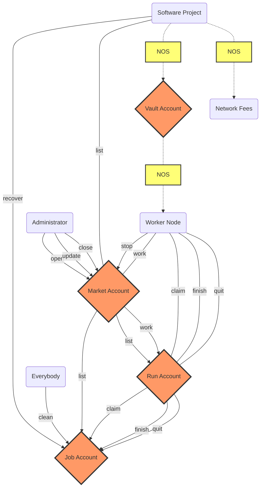
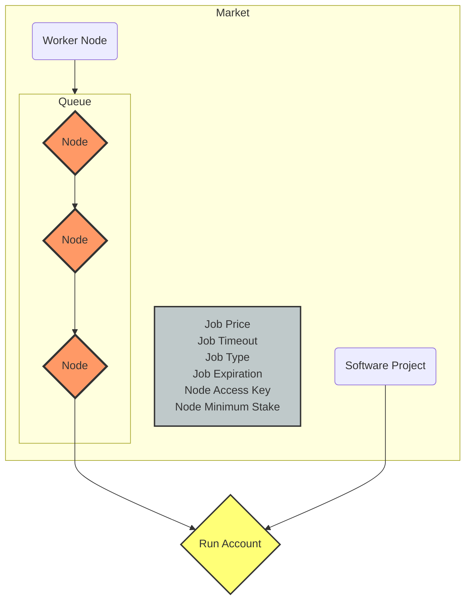
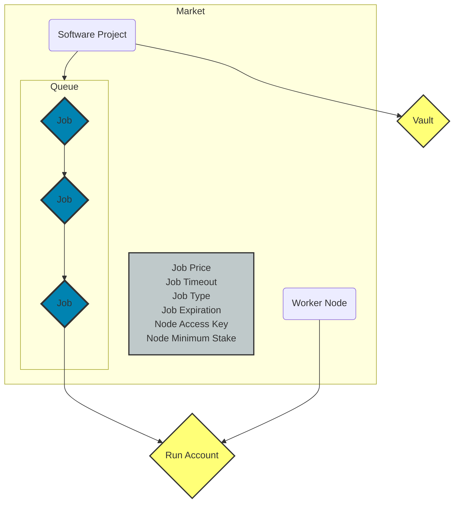
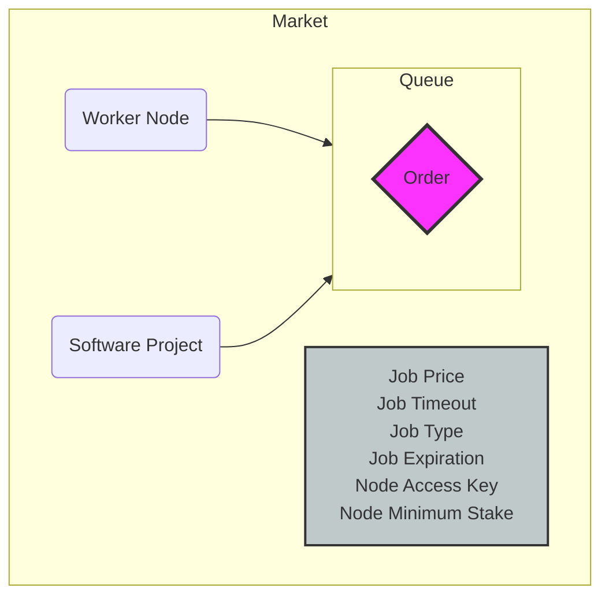

## Diagram

### Instruction Diagram

### Queue Diagrams

Below a representation of the functioning for the different [QueueTypes](#queue-type).

::: tabs

@tab Node Queue
#### Node

When there a more nodes than jobs in a given Market, the queue will fill up with nodes.
The [`QueueType`](#queue-type) will be `Node` in this case.

@tab Job Queue
#### Job Queue

Vise versa, When there a more jobs than nodes in a given Market, the queue will fill up with jobs.
The [`QueueType`](#queue-type) will be `Job` in this case.

@tab Empty Queue
#### Empty Queue

Finally, at the point when the market is satisfied, the queue will be empty.
The [`QueueType`](#queue-type) will be `Unknown` in this case.

:::
