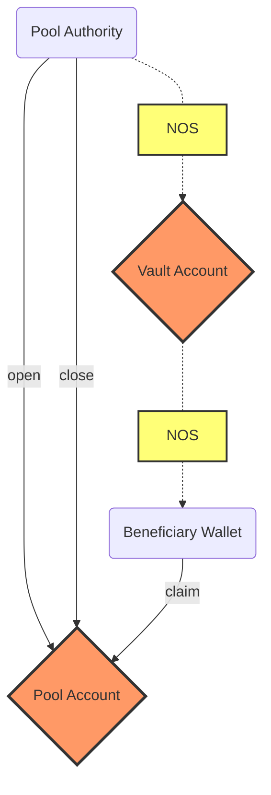

## Diagram

```mermaid
flowchart TB
    authority -- open --> pool
    authority -- close --> pool

    beneficiary -- claim --> pool

    authority -.- nos1 -.-> vault -.- nos2 -.-> beneficiary

    authority(Pool Authority)
    beneficiary(Beneficiary Wallet)

    pool{Pool Account}
    vault{Vault Account}

    nos1[NOS]
    nos2[NOS]

    classDef orange fill:#f96,stroke:#333,stroke-width:3px;
    classDef yellow fill:#ff7,stroke:#333,stroke-width:2px;

    class pool,vault orange
    class nos1,nos2 yellow
```
