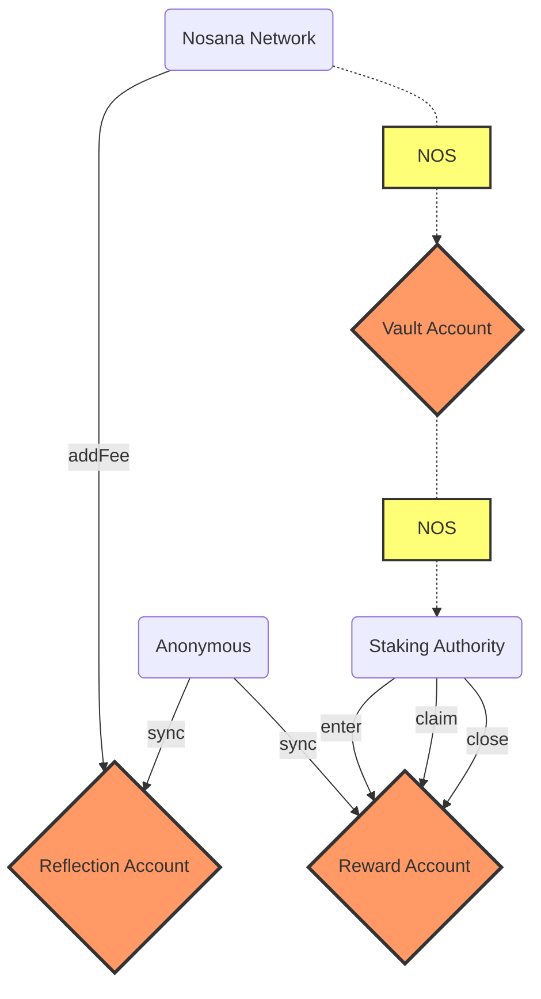

## Diagram

```mermaid
flowchart TB
    authority -->|enter| reward
    authority -->|claim| reward
    authority -->|close| reward

    anybody -->|sync| reflection
    anybody -->|sync| reward

    network -->|addFee| reflection
    network -.- nos1 -.-> vault -.- nos2 -.-> authority

    authority(Staking Authority)
    network(Nosana Network)
    anybody(Anonymous)
    reward{Reward Account}
    vault{Vault Account}
    reflection{Reflection Account}
    nos1[NOS]
    nos2[NOS]

    classDef orange fill:#f96,stroke:#333,stroke-width:3px;
    classDef yellow fill:#ff7,stroke:#333,stroke-width:2px;

    class reward,vault,reflection orange
    class nos1,nos2 yellow
```
