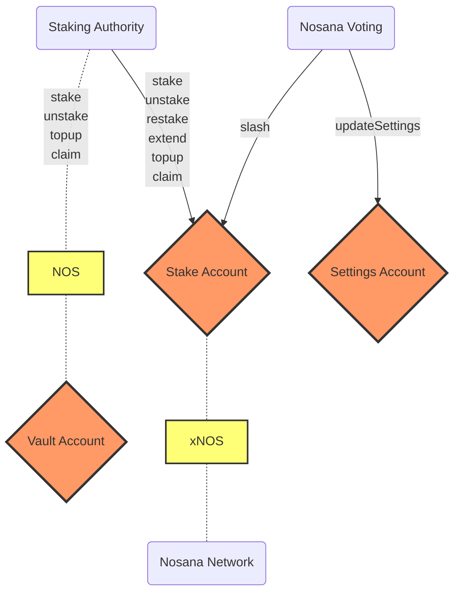

## Diagram

```mermaid
flowchart TB
    authority -->|stake<br>unstake<br>restake<br>extend<br>topup<br>claim| stake

    authority -.-|stake<br>unstake<br>topup<br>claim| nos  -.- vault
    stake     -.- xnos -.- network

    dao -->|slash| stake
    dao -->|updateSettings| settings

    authority(Staking Authority)
    dao(Nosana Voting)
    network(Nosana Network)
    stake{Stake Account}
    vault{Vault Account}
    settings{Settings Account}
    nos[NOS]
    xnos[xNOS]

    classDef orange fill:#f96,stroke:#333,stroke-width:3px;
    classDef yellow fill:#ff7,stroke:#333,stroke-width:2px;

    class stake,vault,settings orange
    class nos,xnos yellow
```
