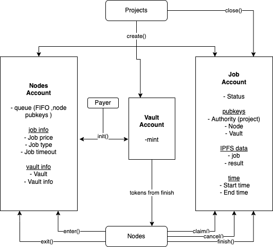

# Nosana Jobs

The jobs program allows users to post jobs and earn tokens by running jobs.

## Instructions

There is a total of 8 instructions

### Payer (1)

#### init()

`init()` initializes a nodes queue and a associated token vault for token deposits.

### Projects (2)

#### create()

`create()` creates a Job with it's required data.
When there is a node ready in the queue it will immediately start running.

#### close()

`close()` closes an existing job account.
When the job was still queued the tokens will be returned to the user.

### Nodes (5)

#### enter()

With `enter()` a node enters the node queue.

A few requirements are enforced:

- A node needs to have a minimum stake in Nosana Staking.
- A node needs to hold an official Nosana NFT.
- A node can only enter the queue once


#### exit()

With `exit()` a node exits the node queue.

#### claim()

With `claim()` a node can claim a job that is in the queued state.

To find unclaimed jobs with anchor:

```javascript
const jobs = await this.jobsProgram.account.jobAccount.all([{
  memcmp: {
    /** offset into program account data to start comparison */
    offset: 96,
    /** data to match, as base-58 encoded string and limited to less than 129 bytes */
    bytes: this.accounts.systemProgram.toBase58()
  }
}]);
```

#### cancel()

With `cancel()` a node can stop running a job that it has started.


#### finish()

With `finish()` a node can can post the result for a job it has finished, and me reimbursed for the work.

## Diagram


